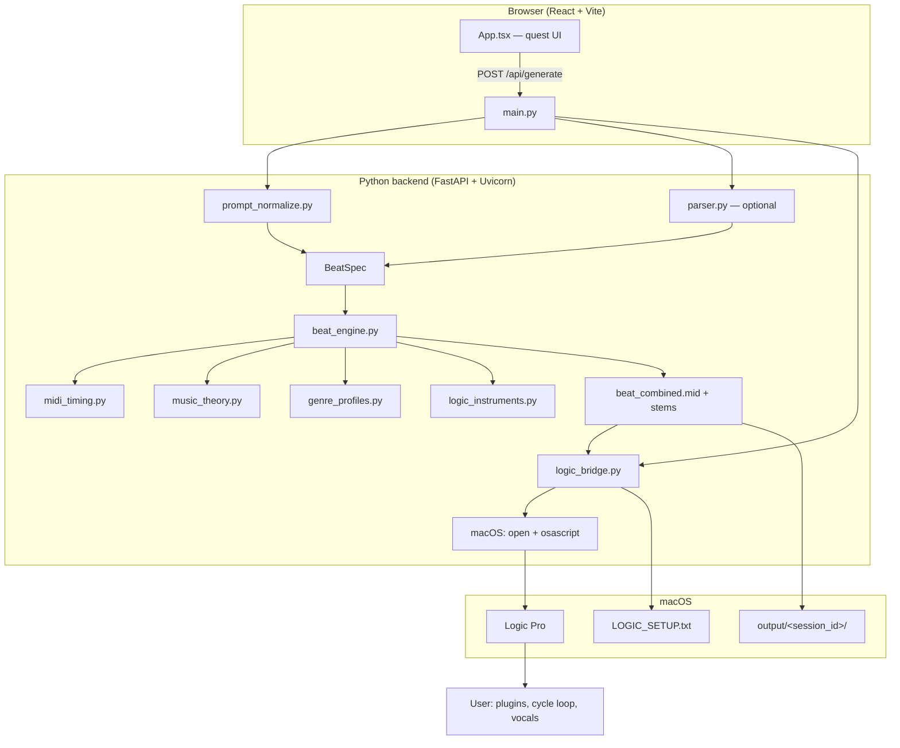
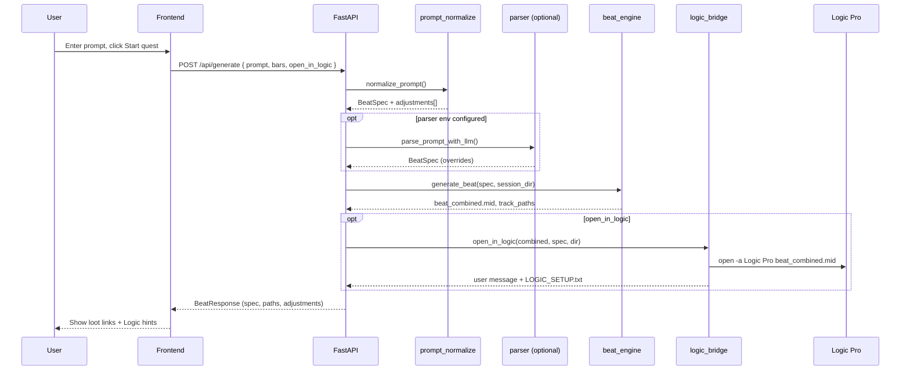
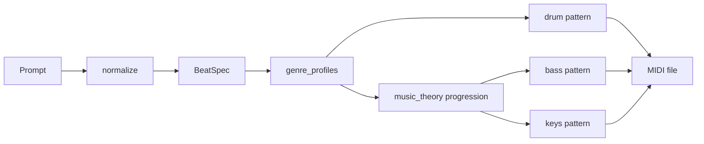

# Architecture — Bloom Beats / Logic Beat NLQ

## Purpose

Turn a **natural-language prompt** (genre, BPM, mood, instruments) into **loop-aligned MIDI** that opens in **Apple Logic Pro**, where you assign stock plugins and record vocals.

There is **no direct Logic Pro API** in this project. Integration uses **Standard MIDI Files** plus macOS **`open`** and **AppleScript** (activate app, optional tempo hint).

---

## High-level system diagram



---

## Request sequence (generate beat)



---

## Repository layout

```
logic-beat-nlq/
├── frontend/                 # React SPA (Vite dev server :5173)
│   ├── src/
│   │   ├── App.tsx           # Main UI, API client
│   │   ├── components/
│   │   │   └── PixelDecor.tsx
│   │   ├── styles.css
│   │   └── types.ts
│   └── vite.config.ts        # Proxies /api → :8000
├── backend/
│   ├── app/
│   │   ├── main.py           # FastAPI routes
│   │   ├── models.py         # Pydantic request/response
│   │   ├── prompt_normalize.py
│   │   ├── parser.py
│   │   ├── genre_profiles.py
│   │   ├── music_theory.py
│   │   ├── beat_engine.py
│   │   ├── midi_timing.py
│   │   ├── logic_instruments.py
│   │   └── logic_bridge.py
│   └── requirements.txt
├── output/                   # Generated sessions (gitignored)
│   └── <session_id>/
│       ├── beat_combined.mid
│       ├── drums.mid | bass.mid | keys.mid
│       └── LOGIC_SETUP.txt
├── scripts/dev.sh
└── docs/                     # You are here
```

---

## Backend modules

| Module | Responsibility |
|--------|----------------|
| `main.py` | HTTP API: `/api/generate`, `/api/download`, `/api/health`; CORS; serves `frontend/dist` in production |
| `models.py` | `BeatRequest`, `BeatSpec`, `BeatResponse` |
| `prompt_normalize.py` | Rule-based prompt cleanup: BPM, genre, full instrument stack, vocal-friendly defaults |
| `parser.py` | Optional cloud JSON parsing when API env vars are set (see `.env.example`) |
| `genre_profiles.py` | Per-genre BPM range, swing, drum program id, bass/synth styles |
| `music_theory.py` | Chord progressions (one chord per bar), voicings, scale degrees |
| `beat_engine.py` | Builds multi-track MIDI: drums (single track), bass, keys |
| `midi_timing.py` | 16th-note quantization, correct delta-times, simultaneous notes, fixed loop length |
| `logic_instruments.py` | Track names + recommended Logic stock plugins |
| `logic_bridge.py` | Writes `LOGIC_SETUP.txt`, opens MIDI in Logic via `open` / AppleScript |

---

## MIDI output design (loop-safe)

All tracks share the **same length**: `bars × 4 beats` at **480 TPQ**.

| Track name | MIDI channel | Content |
|------------|--------------|---------|
| Conductor (meta) | — | Tempo, 4/4, marker |
| Drums | 10 (ch 9) | Kick, snare, clap, hats, shaker — **one track** for Drum Kit Designer |
| Bass / 808 Bass | 1 (ch 0) | Root/fifth per bar from progression |
| Keys / Synth | 2 (ch 1) | Voiced chords per bar |

**Important:** Logic does not auto-load good sounds. User assigns **Drum Kit Designer**, **Studio Bass**, **Vintage Electric Piano** (see `LOGIC_SETUP.txt`).

---

## Genre pipeline



Supported genres: `rnb`, `hiphop`, `pop`, `house`.

---

## API contract

### `POST /api/generate`

**Body:**

```json
{
  "prompt": "Make me a beat for a great R&B song at 90 bpm",
  "bars": 8,
  "open_in_logic": true
}
```

**Response (excerpt):**

```json
{
  "spec": {
    "genre": "rnb",
    "bpm": 90,
    "key": "A",
    "scale": "minor",
    "instruments": ["kick", "snare", "hihat", "bass", "synth"],
    "bars": 8,
    "mood": "smooth"
  },
  "midi_path": "output/abc123/beat_combined.mid",
  "track_paths": { "drums": "...", "bass": "...", "keys": "..." },
  "adjustments": ["Added kick, snare, hats, bass, and keys..."],
  "original_prompt": "...",
  "message": "Opened beat_combined.mid in Logic Pro..."
}
```

### Other routes

- `GET /api/health` — liveness
- `GET /api/download/{path}` — download MIDI under `output/`
- `DELETE /api/session/{id}` — remove session folder

---

## Frontend

- **React 18** SPA, no router.
- Dev: Vite proxies `/api` → `http://127.0.0.1:8000`.
- Prod: `npm run build` → `frontend/dist` mounted by FastAPI.

---

## Deployment modes

| Mode | Command | URLs |
|------|---------|------|
| Dev | `scripts/dev.sh` or separate uvicorn + vite | UI :5173, API :8000 |
| Prod-like | `uvicorn app.main:app` after `npm run build` | :8000 serves UI + API |

---

## Known limitations

1. **No automatic Logic plugin loading** — AppleScript/UI automation is fragile; setup guide is manual.
2. **MIDI ≠ mixed audio** — Quality depends on Logic instruments and mix.
3. **Offline by default** — Rule-based parsing works without any API keys.
4. **macOS + Logic required** for “Open in Logic Pro”.

---

## Future integration (not implemented)

These projects could replace or augment `logic_bridge.py`:

- [MongLong0214/logic-pro-mcp](https://github.com/MongLong0214/logic-pro-mcp) — MCP server, `record_sequence`, `set_instrument`
- [PsychQuant/che-logic-pro-mcp](https://github.com/PsychQuant/che-logic-pro-mcp) — AppleScript MCP for transport/tracks

See [REFERENCES.md](./REFERENCES.md).
